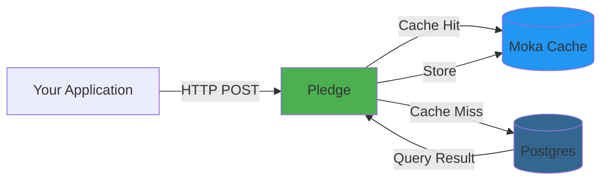

# Pledge 

## **THIS IS A WORK IN PROGRESS, AND NOT READY FOR PRODUCTION USE**

Make your Postgres queries 100x faster

Pledge is a caching layer for Postgres that aims to improve query performance by caching frequently used queries. 
The queries that should be cached are defined in the `pledge.toml` file. With the support for dynamic queries with placeholders, Pledge can cache queries with different parameters, or just queries with predefined parameters.

Pledge is also meant to be used as a pass-through layer for Postgres, allowing you to use it as a caching layer for your Postgres database.

## Architecture



## Config

```toml
# pledge.toml
[database]
url = "postgres://..."

[cache]
global_ttl = 300

[server]
port = 3000

[[queries]]
name = "get_user"
sql = "SELECT id, name FROM users WHERE id = $1"
ttl = 300

[[queries]]
name = "search_users_by_content"
sql = "SELECT u.email, COUNT(*) as match_count, MAX(p.created_at) as latest_match FROM users u JOIN posts p ON u.id = p.user_id WHERE p.content ILIKE $1 OR p.content ILIKE $2 OR p.title ILIKE $3 GROUP BY u.email ORDER BY match_count DESC LIMIT 20"

```

## Preliminary benchmarking

Query search_users_by_content
Body: 
```json 
{
   "sql": "SELECT u.email, COUNT(*) as match_count, MAX(p.created_at) as latest_match FROM users u JOIN posts p ON u.id = p.user_id WHERE p.content ILIKE $1 OR p.content ILIKE $2 OR p.title ILIKE $3 GROUP BY u.email ORDER BY match_count DESC LIMIT 20",
   "params": ["%Lorem%", "%sit%", "%Post%"]
 }
```

| SQL Time (ms) | Cache time (ms) | Speedup |
|------------|------------|------------| 
| ~533ms | ~0.04ms | ~13,225x |

## Supported Data Types
As of right now, pledge supports the following Postgres data types:

1. BOOL
2. “CHAR”
3. SMALLINT, SMALLSERIAL, INT2
4. INT, SERIAL, INT4
5. BIGINT, BIGSERIAL, INT8
6. REAL, FLOAT4
7. DOUBLE PRECISION, FLOAT8
8. VARCHAR, CHAR(N), TEXT, NAME, CITEXT
9. BYTEA
10. VOID
11. NUMERIC
12. TIMESTAMP, TIMESTAMPTZ, DATE, TIME
13. UUID
